# Virtualization

## VMs

### What Is Virtualization?

Virtualization is the process of creating a virtual version or representation of computing resources like servers, storage devices, operating systems (OS), or networks that are abstracted from the physical computing hardware. This abstraction enables greater flexibility, scalability, and agility in managing and deploying computing resources. You can create multiple virtual computers from the hardware and software components of a single machine. You can think of it as essentially a computer-generated computer.

### What Is a Hypervisor?

The software that enables the creation and management of virtual computing environments is called a hypervisor. It’s a lightweight software or firmware layer that sits between the physical hardware and the virtualized environments and allows multiple operating systems to run concurrently on a single physical machine. The hypervisor abstracts and partitions the underlying hardware resources, such as central processing units (CPUs), memory, storage, and networking, and allocates them to the virtual environments.  You can think of the hypervisor as the middleman that pulls resources from the raw materials of your infrastructure and directs them to the various computing instances.

### 2 types of hypervisor
1. bare-metal hypervisors, run directly on the hardware. 
2. hosted hypervisors operate within a host operating system. 

### What are VMs?

- Separate virtual computers running on one set of hardware or a pool of hardware. Each virtual machine acts as an isolated and self-contained environment, complete with its own virtual hardware components, including CPU, memory, storage, and network interfaces. The hypervisor allocates and manages resources, ensuring each VM has its fair share and preventing interference between them.

- VMs run a complete operating system–including its own kernel–as shown in this diagram.

### Properties of VMs
1. Each needs its own OS
2. VMs provide level of isolation so that failures and errors with one VM do not impact other VMs.
3. Can create good testing envs as developers can create snapshots zachycujici particular stav systemu for experiments of rollbacks.
4. Easy migration and cloning.
5. Lower cost and increase efficiency.

### Drawbacks
1. Reqire a lot of system resources
2. Each VM runs not only full copy of OS but virtual copy of HW elements neede for OS.
3. "Monolothic"
4. For some cases overkill -> containers

### Benefits of VMs

1. All OS resources available to apps.
2. Well-established functionality.
3. Robust management tools.
4. Well-known security tools and controls.
5. The ability to run different OS on one physical machine.
6. Cost savings compared to running separate, physical machines.

### What is a bare metal hypervisor?

A hypervisor, also known as a virtual machine monitor or VMM, is a type of virtualization software that supports the creation and management of virtual machines (VMs) by separating a computer’s software from its hardware. Hypervisors translate requests between the physical and virtual resources, making virtualization possible. When a hypervisor is installed directly on the hardware of a physical machine, between the hardware and the operating system (OS), it is called a ***bare metal hypervisor***. Some bare metal hypervisors are embedded into the firmware at the same level as the motherboard basic input/output system (BIOS). This is necessary for some systems to enable the operating system on a computer to access and use virtualization software.

#### What is meant by bare metal?

The term bare metal refers to the fact that there is no operating system between the virtualization software and the hardware. The virtualization software resides on the “bare metal” or the hard disk of the hardware, where the operating system is usually installed. 

#### What is the difference between bare metal hypervisors and hosted hypervisors?

- bare metal hypervisor is the most commonly deployed type of hypervisor
- Bare metal hypervisors are extremely secure since they are isolated from the attack-prone operating system
- They perform better and more efficiently than hosted hypervisors

#### Client/hosted hypervisor

There is another type of hypervisor, known as a client or hosted hypervisor. While bare metal hypervisors run directly on the computing hardware, hosted hypervisors run within the operating system of the host machine. Although hosted hypervisors run within the OS, additional operating systems can be installed on top of it. Hosted hypervisors have higher latency than bare metal hypervisors because requests between the hardware and the hypervisor must pass through the extra layer of the OS. Hosted hypervisors are also known as client hypervisors because they are most often used with end users and software testing, where the higher latency is not as much of a concern.

## Hyper-V
Hyper-V is Microsoft's hardware virtualization product. It lets you create and run a software version of a computer, called a virtual machine. 

### What features does Hyper-V have?

- Computing environment - A Hyper-V virtual machine includes the same basic parts as a physical computer, such as memory, processor, storage, and networking. All these parts have features and options that you can configure different ways to meet different needs. Storage and networking can each be considered categories of their own, because of the many ways you can configure them.
- Disaster recovery and backup - For disaster recovery, Hyper-V Replica creates copies of virtual machines, intended to be stored in another physical location, so you can restore the virtual machine from the copy. For backup, Hyper-V offers two types. One uses saved states and the other uses Volume Shadow Copy Service (VSS) so you can make application-consistent backups for programs that support VSS.
- Optimization - Each supported guest operating system has a customized set of services and drivers, called integration services, that make it easier to use the operating system in a Hyper-V virtual machine.
- Portability - Features such as live migration, storage migration, and import/export make it easier to move or distribute a virtual machine.
- Remote connectivity - Hyper-V includes Virtual Machine Connection, a remote connection tool for use with both Windows and Linux. Unlike Remote Desktop, this tool gives you console access, so you can see what's happening in the guest even when the operating system isn't booted yet.
- Security - Secure boot and shielded virtual machines help protect against malware and other unauthorized access to a virtual machine and its data.

### Hyper-V architecture

Hyper-V supports isolation in terms of a partition. A partition is a logical unit of isolation, supported by the hypervisor, in which operating systems execute. The Microsoft hypervisor must have at least one parent, or root, partition, running Windows. The virtualization management stack runs in the parent partition and has direct access to hardware devices. The root partition then creates the child partitions which host the guest operating systems. A root partition creates child partitions using the hypercall application programming interface (API).

Child partitions also do not have direct access to other hardware resources and are presented a virtual view of the resources, as virtual devices (VDevs). Requests to the virtual devices are redirected either via the VMBus or the hypervisor to the devices in the parent partition, which handles the requests. The VMBus is a logical inter-partition communication channel. The parent partition hosts Virtualization Service Providers (VSPs) which communicate over the VMBus to handle device access requests from child partitions. Child partitions host Virtualization Service Consumers (VSCs) which redirect device requests to VSPs in the parent partition via the VMBus. This entire process is transparent to the guest operating system.

[glossary](https://learn.microsoft.com/en-us/virtualization/hyper-v-on-windows/reference/hyper-v-architecture#glossary)

## Containers

### Cgroup

cgroups (abbreviated from control groups) is a Linux kernel feature that limits, accounts for, and isolates the resource usage (CPU, memory, disk I/O, etc.) of a collection of processes.

One of the design goals of cgroups is to provide a unified interface to many different use cases, from controlling single processes (by using nice, for example) to full operating system-level virtualization (as provided by OpenVZ, Linux-VServer or LXC, for example). Cgroups provides:

- Resource limiting:
    groups can be set not to exceed a configured memory limit, which also includes the file system cache, I/O bandwidth limit, CPU quota limit, CPU set limit, or maximum open files.
- Prioritization:
    some groups may get a larger share of CPU utilization or disk I/O throughput
- Accounting:
    measures a group's resource usage, which may be used, for example, for billing purposes
- Control:
    freezing groups of processes, their checkpointing and restarting

### Diff
With containers, instead of virtualizing an entire computer like a VM, just the OS is virtualized.

### What are containers?
- Containers sit on top of the phys srv and its host OS. Each container shares OS kernel and usaully binaries and libs -> more efficient resource utilization. SHARED COMPONENTS ARE READ-ONLY.

- Container is an isolated, lightweight silo for running an application on the host operating system. Containers build on top of the host operating system's kernel (which can be thought of as the buried plumbing of the operating system), and contain only apps and some lightweight operating system APIs and services that run in user mode, as shown in this diagram.

### Why more efficient than VMs?
1. Using the same libs and bins -> no need to reproduce them for every instance -> lightweigh and portable containers
2. MBs in size and seconds to start -> 2-3tims more apps on a singl srv with containers than with VMs

### +
1. Solve the problem of env inconsistency (runs on my pc)
2. Scalability -> multiple instances of containerized apps can run an be managed in parallel
3. Microservices apps boom thanks to containers as app can be divided into smallelst parts - service and every part can be developed NZ na ostatnich

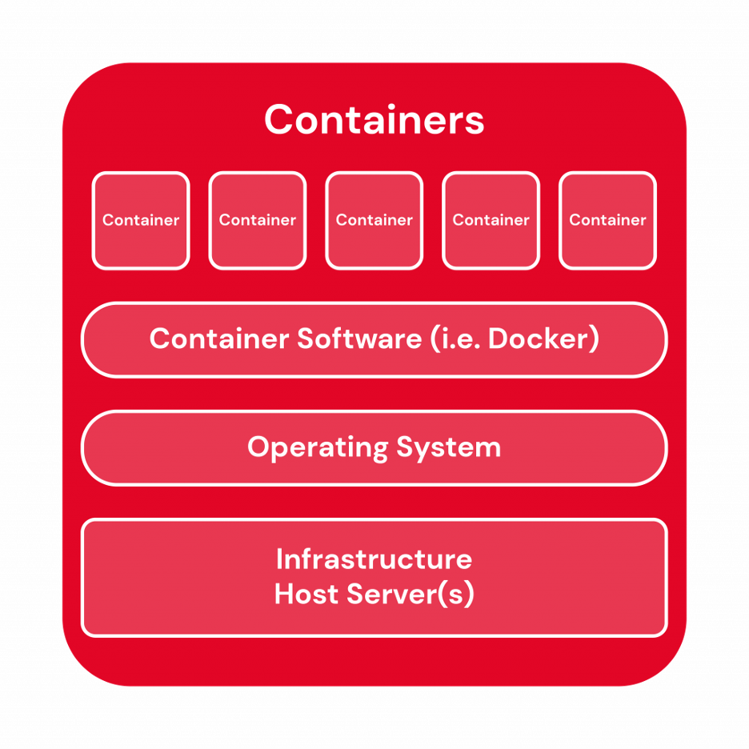

### Container tools
- Linux Containers (LXC): Commonly known as LXC, these are the original Linux container technology. LXC is a Linux operating system-level virtualization method for running multiple isolated Linux systems on a single host.
- Docker: Originally conceived as an initiative to develop LXC containers for individual applications, Docker revolutionized the container landscape by introducing significant enhancements to improve their portability and versatility. Gradually independent container runtime environment.
- Kubernetes: Kubernetes, though not a container software in its essence, serves as a vital container orchestrator. In the realm of cloud-native architecture and microservices, where applications deploy numerous containers ranging from hundreds to thousands or even billions, Kubernetes plays a crucial role in automating the comprehensive management of these containers. While Kubernetes relies on complementary tools like Docker to function seamlessly

### Benefits of Containers

1. Reduced IT management resources.
2. Faster spin ups.
3. Smaller size means one physical machine can host many containers.
4. Reduced and simplified security updates.
5. Less code to transfer, migrate, and upload workloads.

### What Linux containers are, and how they differ from application containers.

#### Application containers
Application containers (such as Docker) are containers running a single process per container. They run stateless types of workloads so that you can ramp up and down as needed – create new containers and delete them at any time. Usually, you don’t need to care about the lifecycle of those containers, as they are meant to be ephemeral.

#### System Containers
system containers, are much closer to a virtual or a physical machine. They run a full operating system inside them, and you manage them exactly as you would a virtual or a physical machine. That means you can install packages inside them, you can manage services, define backup policies, monitoring, and all other aspects as you usually would with a virtual machine. These containers are usually very long-lasting. If you need to update them, you can do so with the normal tooling of the Linux distribution you are using. It also means that you will get normal security updates from distributions for those containers, so you wouldn’t need to wait for any image to be published to get the security fixes.

#### Linux containers
LXC was the first impl of sys containers based on mainline of Linux feature. That means that any distributed Linux kernel and create container on Linux. ***For almost any use case, you could run the exact same workload in a system container and not get any of the overhead that you usually get when using virtual machines. The only exception would be if you needed a specific version of the kernel different from the kernel of the host, for a specific feature of that virtual machine.***

#### +
1. Easier to manage than VMs.
2. Easy share of FS with host.
3. See all processes of container from host.
4. Restricting/Navyseni consumption of resources without restarting anything.
5. Remove/pass into container any device without special FW, HW

#### What is LXD?
LXD is a system container and a virtual machine manager that runs on top of LXC, enhancing the experience and enabling easier control and maintenance. LXD is image-based and provides images for a wide number of different Linux distributions.

#### LXD vs LXC

| LXC | LXD |
|-----|-----|
| Linux container runtime allowing creation of multiple isolated Linux systems (containers) on a control host using a single Linux kernel | System container and virtual machine manager built on top of LXC, enabling easier management, control and integration |
| Only supports containers  | Supports container and VMs |
| Low-level tool requiring expertise | Better user experience through a simple REST API |

#### In a nutshell
Linux containers are system containers that are similar to virtual machines in their behavior and manageability, without the usual VM overhead, and with the density and efficiency of containers. They are suitable for running all types of workloads. With LXD, you can easily run and manage Linux containers, and scale it to suit your needs.

### Container orchestration

Orchestrators help you grow containerized apps at scale, providing functionality for:

1. Deploying at scale
2. Workload scheduling
3. Health monitoring
4. Failing over when a node fails
5. Scaling up or down
6. Networking
7. Service discovery
8. Coordinating app upgrades
9. Cluster node affinity

### Docker

#### What is docker?
Docker is an open platform for developing, shipping, and running applications. Docker enables you to separate your applications from your infrastructure so you can deliver software quickly. 

#### The Docker platform

Docker provides the ability to package and run an application in a loosely isolated environment called a container. The isolation and security lets you run many containers simultaneously on a given host. Containers are lightweight and contain everything needed to run the application, so you don't need to rely on what's installed on the host. You can share containers while you work, and be sure that everyone you share with gets the same container that works in the same way.

#### Docker architecture

Docker uses a client-server architecture. The Docker client talks to the Docker daemon, which does the heavy lifting of building, running, and distributing your Docker containers. The Docker client and daemon can run on the same system, or you can connect a Docker client to a remote Docker daemon. The Docker client and daemon communicate using a REST API, over UNIX sockets or a network interface. Another Docker client is Docker Compose, that lets you work with applications consisting of a set of containers.

##### The Docker daemon

The Docker daemon (dockerd) listens for Docker API requests and manages Docker objects such as images, containers, networks, and volumes. A daemon can also communicate with other daemons to manage Docker services.

##### The Docker client

The Docker client (docker) is the primary way that many Docker users interact with Docker. When you use commands such as docker run, the client sends these commands to dockerd, which carries them out. The docker command uses the Docker API. The Docker client can communicate with more than one daemon.

#### Docker objects
1. **Images**: an image is a read-only template with instructions for creating a Docker container. Often, an image is based on another image, with some additional customization. For example, you may build an image which is based on the ubuntu image, but installs the Apache web server and your application, as well as the configuration details needed to make your application run.
2. **Containers**: a container is a runnable instance of an image. You can create, start, stop, move, or delete a container using the Docker API or CLI. You can connect a container to one or more networks, attach storage to it, or even create a new image based on its current state. By default, a container is relatively well isolated from other containers and its host machine. You can control how isolated a container's network, storage, or other underlying subsystems are from other containers or from the host machine.

### Podman

1. Podman is a daemonless, open source, Linux native tool designed to make it easy to find, run, build, share and deploy applications using Open Containers Initiative (OCI) Containers and Container Images.
2. Podman relies on an OCI compliant Container Runtime (runc, crun, runv, etc) to interface with the operating system and create the running containers. This makes the running containers created by Podman nearly indistinguishable from those created by any other common container engine.
3. Containers under the control of Podman can either be run by root or by a non-privileged user.
4. Podman manages the entire container ecosystem which includes pods, containers, container images, and container volumes using the libpod library.  It allows you to create, run, and maintain those containers and container images in a production environment.
5. There is a RESTFul API to manage containers. We also have a remote Podman client that can interact with the RESTFul service. We currently support clients on Linux, Mac, and Windows. The RESTFul service is only supported on Linux.

#### Rootless podman

Podman also takes advantage of user namespaces to be able to run in rootless mode. Basically, when a non-privileged user runs Podman, the tool sets up and joins a user namespace. After Podman becomes root inside of the user namespace, Podman is allowed to mount certain filesystems and set up the container. Note there is no privilege escalation here other then additional UIDs available to the user.

- [Rootless podman](https://opensource.com/article/19/2/how-does-rootless-podman-work)

### Links

1. [a sysadmin guide to containers](https://opensource.com/article/18/8/sysadmins-guide-containers)
2. [ns](https://opensource.com/article/19/10/namespaces-and-containers-linux)

## Differences

| VMs	        |  Containers |
|---------------|---------------|
| Heavyweight.	| Lightweight. |
| Limited performance.|	Native performance. |
| Each VM runs in its own OS. |	All containers share the host OS. |
| Hardware-level virtualization. |	OS virtualization. |
| Startup time in minutes. |	Startup time in milliseconds. |
| Allocates required memory. |	Requires less memory space. |
| Fully isolated and hence more secure. |	Process-level isolation, possibly less secure. |

## Uses

- VMs help companies make the most of their infrastructure resources by expanding the number of machines you can squeeze out of a finite amount of hardware and software.
- Containers help companies make the most of the development resources by enabling microservices and DevOps practices.

## Containers vs VMs

| Feature | VM | Container |
|---------|----|-----------|
| Isolation | Provides complete isolation from the host operating system and other VMs. ***This is useful when a strong security boundary is critical***, such as hosting apps from competing companies on the same server or cluster. | Typically provides lightweight isolation from the host and other containers, but doesn't provide as strong a security boundary as a VM. (You can increase the security by using Hyper-V isolation mode to isolate each container in a lightweight VM). |
| OS | Runs a complete operating system including the kernel, ***thus requiring more system resources (CPU, memory, and storage)***. | Runs the user mode portion of an operating system, and can be tailored to contain just the needed services for your app, using fewer system resources.
| Guest compatibility |	Runs just about any operating system inside the virtual machine  |	Runs on the ***same operating system version as the host*** (Hyper-V isolation enables you to run earlier versions of the same OS in a lightweight VM environment) |
| Deployment | Deploy ***individual*** VMs by using Windows Admin Center or Hyper-V Manager; deploy ***multiple*** VMs by using PowerShell or System Center Virtual Machine Manager. | Deploy ***individual*** containers by using Docker via command line; deploy ***multiple*** containers by using an orchestrator such as Azure Kubernetes Service. |
| Operating system updates and upgrades  |	Download and install operating system updates on each VM. Installing a new operating system version requires upgrading or often just creating an entirely new VM. This can be time-consuming, especially if you have a lot of VMs...  |	Updating or upgrading the operating system files within a container is the same: 1. Edit your container image's build file (known as a Dockerfile) to point to the latest version of the Windows base image. 2. Rebuild your container image with this new base image. 3. Push the container image to your container registry. 4. Redeploy using an orchestrator. |
| Persistent storage |	Use a virtual hard disk (VHD) for local storage for a single VM, or an SMB file share for storage shared by multiple servers |	Use Azure Disks for local storage for a single node, or Azure Files (SMB shares) for storage shared by multiple nodes or servers. |
| Load balancing |	Virtual machine load balancing moves running VMs to other servers in a failover cluster. |	Containers themselves don't move; instead an orchestrator can automatically start or stop containers on cluster nodes to manage changes in load and availability. |
| Fault tolerance  |	VMs can fail over to another server in a cluster, with the VM's operating system restarting on the new server. |	If a cluster node fails, any containers running on it are rapidly recreated by the orchestrator on another cluster node. |
| Networking | 	Uses virtual network adapters. |	Uses an isolated view of a virtual network adapter, providing a little less virtualization–the host's firewall is shared with containers–while using less resources. |

## Linux namespaces

### What are namespaces?

Namespaces are a Linux kernel feature released in kernel version 2.6.24 in 2008. They provide processes with their own system view, thus isolating independent processes from each other. In other words, namespaces define the set of resources that a process can use (You cannot interact with something that you cannot see). At a high level, they allow fine-grain partitioning of global operating system resources such as mounting points, network stack and inter-process communication utilities. A powerful side of namespaces is that they limit access to system resources without the running process being aware of the limitations. In typical Linux fashion they are represented as files under the /proc/\<pid\>/ns directory.

When we spawn a new process all the namespaces are inherited from its parent.

Namespaces are created with the clone syscall. Namespaces can also be created using the unshare syscall. The difference between clone and unshare is that clone spawns a new process inside a new set of namespaces, and unshare moves the current process inside a new set of namespaces (unshares the current ones).

### Properties
- If we imagine namespaces as boxes for processes containing some abstracted global system resources, one good thing with these boxes is that you can add and remove stuff from one box and it will not affect the content of the other boxes.

- Namespaces are often used when untrusted code has to be executed on a given machine without compromising the host OS.

- PaaS (platform as a service) providers like Google Cloud Engine use namespaced environments to run multiple user services (e.g. web servers, databases) on the same hardware without the possibility of interference of these services.

### Types

    PID namespace: isolation of the system process tree;

    NET namespace: isolation of the host network stack;

    MNT namespace: isolation of host filesystem mount points;

    UTS namespace: isolation of hostname;

    IPC namespace: isolation for interprocess communication utilities (shared segments, semaphores);

    USER namespace: isolation of system users IDs;

    CGROUP namespace: isolation of the virtual cgroup filesystem of the host.

#### PID
Historically, the Linux kernel has maintained a single process tree. The tree data structure contains a reference to every process currently running in a parent-child hierarchy. It also enumerates all running processes in the OS. This structure is maintained in the so called procfs filesystem which is a property of the live system (i.e. it’s present only when the OS is running). This structure allows processes with sufficient privileges to attach to other processes, inspect, communicate and/or kill them. It also contains information about the root directory of a process, its current working directory, the open file descriptors, virtual memory addresses, the available mounting points, etc.

On system boot, the first process started on most of the modern Linux OS is systemd (system daemon), which is situated on the root node of the tree. Its parent is PID=0 which is a non-existing process in the OS. This process is after that responsible for starting the other services/daemons, which are represented as its childs and are necessary for the normal functioning of the OS. These processes will have PIDs > 1 and the PIDs in the tree structure are unique.

With the introduction of the Process namespace (or PID namespace) it became possible to make nested process trees. It allows processes other than systemd (PID=1) to perceive themselves as the root process by moving on the top of a subtree, thus obtaining PID=1 in that subtree. All processes in the same subtree will also obtain IDs relative to the process namespace. 

To sum up about the process namespace:

    Processes within a namespace only see (interact with) the processes in the same PID namespace (isolation);

    Each PID namespace has its own numbering starting at 1 (relative);

    This numbering is unique per process namespace - If PID 1 goes away then the whole namespace is deleted;

    Namespaces can be nested;

    A process ends up having multiple PIDs (when namespaces are nested);

    All ‘ps’-like commands use the virtual procfs file system mount to deliver their functionalities.

#### NET

A network namespace limits the view of a process of the host network. It allows a process to have its own separation from the host network stack (set of network interfaces, routing rules, set of netfilter hooks).

We can see that the entire network stack of the process has changed. There is only the loopback interface which is also down. Said with other words, this process is unreachable via the network. But that’s a problem, isn’t it? Why do we need a virtually isolated network stack if we can’t communicate through it? Here is an illustration of the situation:

##### Connecting a pair of namespaces

In order to make a process inside a new network namespace reachable from another network namespace, a pair of virtual interfaces is needed. These two virtual interfaces come with a virtual cable - what comes at one of the ends goes to the other (like a Linux pipe). So if we want to connect a namespace (let’s say N1) and another one (let’s say N2) we have to put one of the virtual interfaces in the network stack of N1 and the other in the network stack of N2.

To sum up about the network namespace:

    Processes within a given network namespace get their own private network stack, including network interfaces, routing tables, iptables rules, sockets (ss, netstat);

    The connection between network namespaces can be done using two virtual interfaces;

    Communication between isolated network stacks in the same namespace is done using a bridge;

    The NET namespace can be used to simulate a “box” of Linux processes where only a few of them would be able to reach the outside world (by removing the host’s default gateway from the routing rules of some NET namespaces).

# Cloud platforms

## Execution models

### VMs

Virtual Machines also monitors the hardware hosting each VM you create. If a physical server running
a VM fails, the platform notices this and starts the same VM on another machine. And assuming you
have the right licensing, you can copy a changed VHD out of your OS disk, then run it someplace
else, such as in your own on-premises datacenter or at another cloud provider.

Windows Azure Virtual Machines can be used in a variety of ways. The primary scenarios that
Microsoft targets include these:
- VMs for development and test. Development groups commonly need VMs with specific
configurations for creating applications. Windows Azure Virtual Machines provides a
straightforward and economical way to create these VMs, use them, then remove them when
they’re no longer needed.
- Running applications in the cloud. For some applications, running on the public cloud makes
economic sense. Think about an application with large spikes in demand, for example. It’s always
possible to buy enough machines for your own datacenter to run this application, but most of
those machines are likely to sit unused much of the time. Running this application on Windows
Azure lets you pay for extra VMs only when you need them, shutting them down when a demand
spike has ended. Or suppose you’re a start-up that needs on-demand computing resources
quickly and with no commitment. Once again, Windows Azure can be the right choice.
- Extending your own datacenter into the public cloud. With Windows Azure Virtual Network, your
organization can create a virtual network (VNET) that makes a group of Windows Azure VMs
appear to be part of your own on-premises network. This allows running applications such as
SharePoint and others on Windows Azure, an approach that might be easier to deploy and/or
less expensive than running them in your own datacenter.
- Disaster recovery. Rather than paying continuously for a backup datacenter that’s rarely used,
IaaS-based disaster recovery lets you pay for the computing resources you need only when you
really need them. For example, if your primary datacenter goes down, you can create VMs
running on Windows Azure to run essential applications, then shut them down when they’re no
longer needed.

Grouping VMs into a cloud service lets you use other options as well. Windows Azure provides load
balancing for VMs in the same cloud service, spreading user requests across them. VMs connected in
this way can also communicate directly with one another over the local network within a Windows
Azure datacenter.

### Web sites

 (web hosting)

Windows Azure Web Sites runs Windows Server and Internet Information Services (IIS) in a virtual
machine. As the figure shows, a single VM typically contains multiple web sites created by multiple
users, although it’s also possible for a site to run in its own reserved VM. Whether a VM is shared or
not, you can think of Web Sites as supporting three main scenarios: building static web sites,
deploying popular open source applications, and creating web applications. It’s worth looking at
each one separately.

Building a static web site requires nothing more than copying files containing HTML and other web
content into the appropriate directories, then letting IIS serve those files to users. Windows Azure
Web Sites looks much like a standard IIS environment, so doing this is straightforward.

Web Sites also has built-in support for a number of popular open source applications, including
Drupal, WordPress, and Joomla. A user can choose the application she wants from a menu, then have
it automatically installed and made available for her to use. There’s no code to write—it’s just
configuration. And because many of these applications use MySQL, they rely on a MySQL service
provided for Windows Azure by ClearDB, a Microsoft partner.

Developers can also create full-fledged web applications with Web Sites. The technology supports
creating applications using ASP.NET, PHP, and Node.js, and once again, the environment looks like
on-premises IIS. Applications can use sticky sessions, for example, and existing web applications can
be moved to this cloud platform with no changes.

### Cloud services
Like the other Windows Azure compute options, Cloud Services relies on VMs. The technology
provides two slightly different VM options: instances of web roles run a variant of Windows Server
with IIS, while instances of worker roles run the same Windows Server variant without IIS. A Cloud
Services application relies on some combination of these two options.

As the figure suggests, all of the VMs in a single application run in the same cloud service, as
described earlier with Windows Azure Virtual Machines. Because of this, users access the application
through a single public IP address, with requests automatically load balanced across the application’s
VMs. And as with cloud services created using Windows Azure Virtual Machines, the platform will
deploy the VMs in a Cloud Services application in a way that avoids a single point of hardware
failure.

Even though applications run in virtual machines, it’s important to understand that Cloud Services
provides PaaS, not IaaS. Here’s one way to think about it: With IaaS, such as Windows Azure Virtual
Machines, you first create and configure the environment your application will run in, then deploy
your application into this environment. You’re responsible for managing much of this world, doing
things such as deploying new patched versions of the operating system in each VM. In PaaS, by
contrast, it’s as if the environment already exists. All you have to do is deploy your application.
Management of the platform it runs on, including deploying new versions of the operating system, is
handled for you.

With Cloud Services, you don’t create virtual machines. Instead, you provide a configuration file that
tells Windows Azure how many of each you’d like, such as three web role instances and two worker
role instances, and the platform creates them for you. You still choose what size those VMs should
be—the options are the same as with Windows Azure VMs—but you don’t explicitly create them
yourself. If your application needs to handle a greater load, you can ask for more VMs, and Windows
Azure will create those instances.

The PaaS nature of Cloud Services has other implications, too. One of the most important is that
applications built on this technology should be written to run correctly when any web or worker role
instance fails. To achieve this, a Cloud Services application shouldn’t maintain state in the file system
of its own VMs. Unlike VMs created with Windows Azure Virtual Machines, writes made to Cloud
Services VMs aren’t persistent; there’s nothing like a Virtual Machines data disk. Instead, a Cloud
Services application should explicitly write all state to SQL Database, blobs, tables, or some other
external storage. Building applications this way makes them easier to scale and more resistant to
failure, both important goals of Cloud Services.

### Differences
Cloud Services, which was the initial execution model provided by Windows Azure, is an explicitly
PaaS approach. While the line between PaaS and web hosting is blurry, Cloud Services differs in
some important ways from Web Sites, including the following:
- Unlike Web Sites, Cloud Services gives you administrative access to your application’s VMs. This
lets you install arbitrary software that your application needs, something that’s not possible with
Web Sites.
- Because Cloud Services offers both web roles and worker roles, it’s a better choice than Web
Sites for multi-tier applications that need separate VMs for their business logic.
- Cloud Services provides separate staging and production environments, making application
updates somewhat smoother than Web Sites.
- Unlike Web Sites, you can use networking technologies such as Windows Azure Virtual Network
and Windows Azure Connect to hook on-premises computers to Cloud Services applications.
- Cloud Services lets you use Remote Desktop to connect directly to an application’s VMs,
something that’s not possible with Web Sites.
- Because it’s PaaS, Cloud Services also offers some advantages over Windows Azure Virtual Machines.
More management tasks are done for you, for instance, such as deploying operating system updates,
and so your operations costs are likely to be lower than with the IaaS approach of Windows Azure
Virtual Machines.

### Roles

Windows Azure today
lets developers create three different kinds of roles:
- Web role: As the name suggests, Web roles are largely intended for logic that interacts with the
outside world via HTTP. Code written as a Web role typically gets its input through Internet
Information Services (IIS), and it can be created using various technologies, including ASP.NET,
Windows Communication Foundation (WCF), PHP, and Java.
- Worker role: Logic written as a Worker role can interact with the outside world in various ways—it’s
not limited to HTTP. For example, a Worker role might contain code that converts videos into a
standard format or calculates the risk of an investment portfolio or performs some kind of data
analysis.
- Virtual Machine (VM) role: A VM role runs an image—a virtual hard disk (VHD)—of a Windows Server
2008 R2 virtual machine. This VHD is created using an on-premises Windows Server machine, then
uploaded to Windows Azure. Once it’s stored in the cloud, the VHD can be loaded on demand into a
VM role and executed.

Whatever roles an application uses, Windows Azure generally requires it to run at least two instances of each one.
Depending on the work it needs to do, an application might run two, ten, or fifty instances of a role.

### Azure kubernetes

Azure Kubernetes Service (AKS) is a managed Kubernetes service that you can use to deploy and manage containerized applications. You need minimal container orchestration expertise to use AKS. AKS reduces the complexity and operational overhead of managing Kubernetes by offloading much of that responsibility to Azure. AKS is an ideal platform for deploying and managing containerized applications that require high availability, scalability, and portability, and for deploying applications to multiple regions, using open-source tools, and integrating with existing DevOps tools.

This article is intended for platform administrators or developers who are looking for a scalable, automated, managed Kubernetes solution.
#### Overview of AKS

AKS reduces the complexity and operational overhead of managing Kubernetes by shifting that responsibility to Azure. When you create an AKS cluster, Azure automatically creates and configures a control plane for you at no cost. The Azure platform manages the AKS control plane, which is responsible for the Kubernetes objects and worker nodes that you deploy to run your applications. Azure takes care of critical operations like health monitoring and maintenance, and you only pay for the AKS nodes that run your applications.

### High performance computing
The essence of high-performance computing (HPC) is processing power. Whether implemented using traditional
supercomputers or more modern compute clusters, HPC requires having lots of available computing resources.

But with the rise of cloud computing, the world of HPC is changing. Why not take advantage of the massive data
centers now available in the cloud? For example, Microsoft’s Windows Azure provides on-demand access to an
abundance of virtual machines (VMs) and acres of cheap storage, letting you pay only for the resources you use.
This is appealing for applications that need lots of processing power.

The potential benefits for HPC are obvious. Rather than relying solely on your own on-premises computing
resources, using the cloud gives you access to more compute power when you need it. For example, suppose your
on-premises systems are sufficient for most—but not all—of your organization’s workloads. Or suppose one of
your HPC applications sometimes needs more processing power. Rather than buy more machines, you can instead
rely on a cloud data center to provide extra computing resources on demand.

While the rise of cloud computing will surely have a big impact on the HPC world, the reality is that on-premises
HPC computing isn’t going away. Instead, providing a way to combine the two approaches—on-premises and
cloud—makes sense. This is exactly what Microsoft has done with Windows HPC Server and Windows Azure,
supporting all three possible combinations: applications that run entirely on-premises, applications that run
entirely in the cloud, and applications that are spread across both.

### Blobs

The word “blob” is short for “Binary Large OBject”, and it describes exactly what a blob is: a collection of binary
information. Yet even though blobs are simple, they’re quite useful. Figure 1 illustrates the basics of Azure Blobs, a
fundamental storage service provided by this cloud platform.

To use blobs, you first create an Azure storage account. As part of this, you specify the Azure datacenter that will
store the things you create using this account. You next create one or more containers in your storage account,
then create blobs in those containers.
Azure provides two different kinds of blobs. The choices are:
- Block blobs, each of which can contain up to 200 gigabytes of data. As its name suggests, a block blob is
subdivided into some number of blocks. If a failure occurs while transferring a block blob, retransmission can
resume with the most recent block rather than sending the entire blob again.
- Page blobs, which can be as large at one terabyte each. Page blobs are designed for random access, and so
each one is divided into some number of pages. An application is free to read and write individual pages at
random in the blob. For example, Azure’s infrastructure as a service (IaaS) technology, called Azure Virtual
Machines, uses page blobs as persistent storage for virtual machines.

Whether you choose block blobs or page blobs, applications can access blob data directly through a RESTful
interface or using the Azure Storage Client library, which provides a more developer-friendly wrapper for the raw
RESTful services. Blobs are also used behind the scenes in other technologies. One example is Microsoft
StorSimple, an on-premises appliance that automatically moves data between local disk and Azure Blobs based on
how that data is used. Other Azure data technologies also rely on Blobs, as described later.

### MapReduce

MapReduce is a programming model and an associated implementation for processing and generating big data sets with a parallel and distributed algorithm on a cluster.[1][2][3]

A MapReduce program is composed of a map procedure, which performs filtering and sorting (such as sorting students by first name into queues, one queue for each name), and a reduce method, which performs a summary operation (such as counting the number of students in each queue, yielding name frequencies).

Map is an idiom in parallel computing where a simple operation is applied to all elements of a sequence, potentially in parallel.[1] It is used to solve embarrassingly parallel problems: those problems that can be decomposed into independent subtasks, requiring no communication/synchronization between the subtasks except a join or barrier at the end.

In computer science, the reduction operator[1] is a type of operator that is commonly used in parallel programming to reduce the elements of an array into a single result. Reduction operators are associative and often (but not necessarily) commutative.

As such, a single-threaded implementation of MapReduce is usually not faster than a traditional (non-MapReduce) implementation; any gains are usually only seen with multi-threaded implementations on multi-processor hardware. The use of this model is beneficial only when the optimized distributed shuffle operation (which reduces network communication cost) and fault tolerance features of the MapReduce framework come into play. Optimizing the communication cost is essential to a good MapReduce algorithm.

A MapReduce framework (or system) is usually composed of three operations (or steps):

    Map: each worker node applies the map function to the local data, and writes the output to a temporary storage. A master node ensures that only one copy of the redundant input data is processed.
    Shuffle: worker nodes redistribute data based on the output keys (produced by the map function), such that all data belonging to one key is located on the same worker node.
    Reduce: worker nodes now process each group of output data, per key, in parallel.

### Hadoop

As usual with NoSQL technologies, HDInsight HBase lacks several things that are standard in relational databases.
There’s no query language, for example, and no way to create indexes other than on the row key. Transactions are
possible, but they’re limited: all of the data in a transaction must be contained within a single row of the same
table. And HBase has no notion of data types—it stores everything as a string of bytes.

To work with HBase on Azure, you can use HDInsight to create a Hadoop cluster, then ask it to deploy HBase on
this cluster. As with MapReduce, HDInsight HBase stores data in Azure blobs rather than HDFS. For applications
that need to work with very large tables, HDInsight HBase can be just the right solution.

Storing all of this data and building applications to analyze it requires a new kind of software foundation.
Remarkably, our industry has largely settled on a single approach for doing this: an open source technology called
Hadoop. Even though it has one name, Hadoop is actually a family of technologies designed to run on a cluster of
servers. Figure 6 shows the basics.

To store lots of data cheaply, Hadoop includes the Hadoop Distributed File System (HDFS). HDFS provides a way to
store very large files using low-cost commodity disks. On top of this, Hadoop includes Yet Another Resource
Negotiator (YARN). YARN is cluster management software, and it allows running a variety of other technologies on
the cluster. For example, it’s common to run MapReduce in a Hadoop cluster, software that supports creating
distributed applications for analyzing big data. As the figure shows, the Hadoop family also includes HBase, a
NoSQL database that runs directly on top of HDFS.

Azure HDInsight is a managed service that supports all of these technologies. The rest of this section looks a little
more closely at the two most visible aspects of HDInsight: MapReduce and HBase.

## Communication

### VN

Windows Azure lets you create virtual machines (VMs) that run in Microsoft datacenters. Suppose
your organization wants to use those VMs to run enterprise applications or other software that will
be used by your firm’s employees. Maybe you want to create a SharePoint farm in the cloud, for
example, or run an inventory management application. To make life as easy as possible for your
users, you’d like these applications to be accessible just as if they were running in your own
datacenter.

There’s a standard solution to this kind of problem: create a virtual private network (VPN).
Organizations of all sizes do this today to link, say, branch office computers to the main company
datacenter. This same approach can work with Windows Azure VMs, as Figure 1 shows.

Azure Virtual Network is a service that provides the fundamental building block for your private network in Azure. An instance of the service (a virtual network) enables many types of Azure resources to securely communicate with each other, the internet, and on-premises networks. These Azure resources include virtual machines (VMs).

Why use an Azure virtual network?

Key scenarios that you can accomplish with a virtual network include:

    Communication of Azure resources with the internet.

    Communication between Azure resources.

    Communication with on-premises resources.

    Filtering of network traffic.

    Routing of network traffic.

    Integration with Azure services.

Sometimes, connecting your entire on-premises network to a group of Windows Azure VMs is the
right thing to do. Windows Azure Virtual Network is designed to solve this problem. But what if you
don’t need a solution that’s this general? Suppose instead that all you’d like to do is connect a single
Windows Azure application—or even a single VM—to a specific group of computers on your local
network. Addressing this problem is the goal of Windows Azure Connect, as Figure 2 shows.

Unlike Virtual Network, Connect doesn’t require using a VPN gateway device, nor does it require the
services (or approval) of a network administrator. Instead, anybody with administrative access to a
Windows machine in the local network can install the required Windows Azure Connect software on
that machine. Once this is done, the software can create an IPsec link with designated Windows
Azure VMs.

### Traffic manager

Imagine that you’ve built a successful Windows Azure application. Your app is used by many people
in many countries around the world. This is a great thing, but as is so often the case, success brings
new problems. Here, for instance, your application most likely runs in multiple Windows Azure
datacenters in different parts of the world. How can you intelligently route traffic across these
datacenters so that your users always get the best experience?
Windows Azure Traffic Manager is designed to solve this problem.

In this example, your application is running in VMs spread across four datacenters: two in the US,
one in Europe, and one in Asia. Suppose a user in Berlin wishes to access the application. If you’re
using Traffic Manager, here’s what happens.
As usual, the user’s system looks up the DNS name of the application (step 1). This query is
redirected to the Windows Azure DNS system (step 2), which then looks up the Traffic Manager
policy for this application. Each policy is created by the owner of a particular Windows Azure
application, either through a graphical interface or a REST API. However it’s created, the policy
specifies one of three options:
- Performance: All requests are sent to the closest datacenter.
- Failover: All requests are sent to the datacenter specified by the creator of this policy, unless that
datacenter is unavailable. In this case, requests are routed to other datacenters in the priority
order defined by the policy’s creator.
- Round Robin: All requests are spread equally across all datacenters in which the application is
running.

Once it has the right policy, Traffic Manager figures out which datacenter this request should go to
based on which of the three options is specified (step 3). It then returns the location of the chosen
datacenter to the user (step 4), who accesses that instance of the application (step 5).

### Service bus

Service Bus is a multi-tenant cloud service, which means that the service is shared by multiple users.
Each user, such as an application developer, creates a namespace, then defines the communication
mechanisms she needs within that namespace. Figure 1 shows how this looks.

Within a namespace, you can use one or more instances of three different communication
mechanisms, each of which connects applications in a different way. The choices are:
- Queues, which allow one-directional communication. Each queue acts as an intermediary
(sometimes called a broker) that stores sent messages until they are received.
- Topics, which provide one-directional communication using subscriptions. Like a queue, a topic
acts as a broker, but it allows each subscription to see only messages that match specific criteria.
- Relays, which provide bi-directional communication. Unlike queues and topics, a relay doesn’t
store in-flight messages—it’s not a broker. Instead, it just passes them on to the destination
application.

When you create a queue, topic, or relay, you give it a name. Combined with whatever you called
your namespace, this name creates a unique identifier for the object. Applications can provide this
name to Service Bus, then use that queue, topic, or relay to communicate with one another.

### Msg queueing

Suppose you decide to connect two applications using a Service Bus queue. Figure 2 illustrates this
situation.
The process is simple: A sender sends a message to a Service Bus queue, and a receiver picks up that
message at some later time. A queue can have just a single receiver, as Figure 2 shows, or multiple
applications can read from the same queue. In the latter situation, each message is typically read by
just one receiver—queues don’t provide a multi-cast service.
Each message has two parts: a set of properties, each a key/value pair, and a binary message body.

A receiver can read a message from a Service Bus queue in two different ways. The first option, called
ReceiveAndDelete, removes a message from the queue and immediately deletes it. This is simple, but
if the receiver crashes before it finishes processing the message, the message will be lost. Since it’s
been removed from the queue, no other receiver can access it.
The second option, PeekLock, is meant to help with this problem. Like ReceiveAndDelete, a PeekLock
read removes a message from the queue. It doesn’t delete the message, however. Instead, it locks
the message, making it invisible to other receivers, then waits for one of three events:
- If the receiver processes the message successfully, it calls Complete, and the queue deletes the
message.
- If the receiver decides that it can’t process the message successfully, it calls Abandon. The queue
then removes the lock from the message and makes it available to other receivers.
- If the receiver calls neither of these within a configurable period of time (by default, 60 seconds),
the queue assumes the receiver has failed. In this case, it behaves as if the receiver had called
Abandon, making the message available to other receivers.

### Topics

A topic is similar in many ways to a queue. Senders submit messages to a topic in the same way that
they submit messages to a queue, and those messages look the same as with queues. The big
difference is that topics let each receiving application create its own subscription by defining a filter.
A subscriber will then see only the messages that match that filter.

### Relays

Both queues and topics provide one-way asynchronous communication through a broker. Traffic
flows in just one direction, and there’s no direct connection between senders and receivers. But what
if you don’t want this? Suppose your applications need to both send and receive, or perhaps you
want a direct link between them—you don’t need a place to store messages in between. To address
problems like this, Service Bus provides relays.

Suppose you want to connect two on-premises applications, both running inside corporate
datacenters. Each of these applications sits behind a firewall, and each datacenter probably uses
network address translation (NAT). The firewall blocks incoming data on all but a few ports, and NAT
implies that the machine each application is running on probably doesn’t have a fixed IP address.
Without some extra help, connecting these applications over the public Internet is problematic.
A Service Bus relay provides this help. To communicate bi-directionally through a relay, each
application establishes an outbound TCP connection with Service Bus, then keeps it open. All
communication between the two applications will travel over these connections. Because each
connection was established from inside the datacenter, the firewall will allow incoming traffic to each
application—data sent through the relay—without opening new ports. This approach also gets
around the NAT problem, because each application has a consistent endpoint throughout the
communication. By exchanging data through the relay, the applications can avoid the problems that
would otherwise make communication difficult.
To use Service Bus relays, applications rely on Windows Communication Foundation (WCF). Service
Bus provides WCF bindings that make it straightforward for Windows applications to interact via
relays. Applications that already use WCF can typically just specify one of these bindings, then talk to
each other through a relay. Unlike queues and topics, however, using relays from non-Windows
applications, while possible, requires some programming effort; no standard libraries are provided.
Unlike queues and topics, applications don’t explicitly create relays. Instead, when an application that
wishes to receive messages establishes a TCP connection with Service Bus, a relay is created
automatically. When the connection is dropped, the relay is deleted. To let an application find the
relay created by a specific listener, Service Bus provides a registry that allows locating a specific relay
by name.
Relays are the right solution when you need direct communication.

### Caching

Applications tend to access the same data over and over. One way to improve performance is to
keep a copy of that data closer to the application, minimizing the time needed to retrieve it.
Windows Azure provides two different services for doing this: in-memory caching of data used by
Windows Azure applications and a content delivery network (CDN) that caches blob data on disk
closer to its users.

#### Caching
Accessing data stored in any of Windows Azure’s data management services—SQL Database, Tables,
or Blobs—is quite fast. Yet accessing data stored in memory is even faster. Because of this, keeping
an in-memory copy of frequently accessed data can improve application performance. You can use
Windows Azure’s in-memory Caching to do this.
A Cloud Services application can store data in this cache, then retrieve it directly without needing to
access persistent storage. As Figure 7 shows, the cache can be maintained inside your application’s
VMs or be provided by VMs dedicated solely to caching. In either case, the cache can be distributed,
with the data it contains spread across multiple VMs in a Windows Azure datacenter.

#### CDN
Suppose you need to store blob data that will be accessed by users around the world. Maybe it’s a
video of the latest World Cup match, for instance, or driver updates, or a popular e-book. Storing a
copy of the data in multiple Windows Azure datacenters will help, but if there are lots of users, it’s
probably not enough. For even better performance, you can use the Windows Azure CDN.
The CDN has dozens of sites around the world, each capable of storing copies of Windows Azure
blobs. The first time a user in some part of the world accesses a particular blob, the information it
contains is copied from a Windows Azure datacenter into local CDN storage in that geography. After
this, accesses from that part of the world will use the blob copy cached in the CDN—they won’t need
to go all the way to the nearest Windows Azure datacenter. The result is faster access to frequently
accessed data by users anywhere in the world.

## Other

### ML
The machine learning process isn’t especially simple. To make life easier for people doing machine learning, Azure
ML provides several different components. Figure 4 shows what those components are and where they fit into the
machine learning process.

The components that Azure ML provides are the following:
- ML Studio, a graphical tool that can be used to control the process from beginning to end. Using this tool,
people on the machine learning team can apply data pre-processing modules to raw data, run experiments on
the prepared data using a machine learning algorithm, and test the resulting model. Once an effective model
is found, ML Studio also helps its users deploy that model on Microsoft Azure.
- A set of data preprocessing modules.
- A set of machine learning algorithms.
- An Azure ML API that lets applications access the chosen model once it’s deployed on Azure.

All of these are important, and we’ll examine them a bit more closely later. For now, however, it’s worth looking in
a little more detail at ML Studio. Figure 5 shows an example of the user interface this tool provides.

### Cloud design patterns
[Patterns](https://learn.microsoft.com/en-us/azure/architecture/patterns/#catalog-of-patterns)

## Security

### SAML
SAML is an XML-based markup language for security assertions (statements that service providers use to make access-control decisions). SAML is also:

    A set of XML-based protocol messages
    A set of protocol message bindings
    A set of profiles (utilizing all of the above)

The SAML specification defines three roles: the principal (typically a human user), the identity provider (IdP) and the service provider (SP). In the primary use case addressed by SAML, the principal requests a service from the service provider. The service provider requests and obtains an authentication assertion from the identity provider. On the basis of this assertion, the service provider can make an access control decision, that is, it can decide whether to perform the service for the connected principal.

SAML is primarily an authentication system, while OAuth is an authorization system. Authentication is about confirming the user’s identity. Authorization is about deciding what services they can access.

#### What Is Security Assertion Markup Language (SAML)?

When a user interacts with SAML, both a service provider and identity provider are involved. The service provider is typically the website the user is interacting with.

If the user tries to access a protected resource, or tries to log in, the service provider sends the browser a SAML request, which the browser then uses to connect to the identity provider. The SSO service asks the user for credentials, and the user provides their login details, such as a username and password.

Here’s a diagram showing how single sign-on works:

### What is Open Authorization (OAuth)?

There are two versions of OAuth, and there are differences between them. This article focuses on version 2.0, which has been around since 2012. An updated version 2.1 has been proposed but not yet approved.

With OAuth, a user making a login or resource request is redirected to an authorization server, which is run by a company like Google, Twitter, or Facebook. Companies can also run their own authorization server. The authorization server presents the user with a familiar login screen. However, the login screen won’t grant access directly to that service. Rather, it allows the site making the redirect to access the user’s data supplied by that service.

There are several possible workflows with OAuth. In the deprecated implicit grant, when the user provides appropriate credentials, the authorization server provides them with an access token and redirects them to a URI originally supplied by the client.

In the authorization code grant workflow, the authorization server redirects the user back to the original application with a code in the URI. That application requests an access token from the authentication server, using the code and their own secret credentials.

Since this grant avoids always sending the access token directly to the client, you have more architectural flexibility. In addition, you don’t send the token over an accessible channel like the URL query string, which prevents malicious access if the user’s device is compromised.

Access tokens are typically in JSON Web Token (JWT) format, but can be in other formats as well, even regular text.

#### Typical SAML Use Cases

SAML allows users to conveniently access multiple resources safely and securely. It can reduce support requests since users don’t need to create and store credentials for every service they use. It tends to be popular with groups that need to regularly grant access to specific sets of resources, as it minimizes the work involved.
- Enterprise Access. SAML is widely associated with large organizations. You can use it to provide users with access to a system, and use its attributes to control what exactly they can do. You can also use attributes to group users, and then dynamically adjust what they have access to.
- Single Sign-On between Separate Platforms.Single sign-on (SSO) is SAML’s most common use, allowing users to authenticate across multiple domains without needing new credentials each time.If your company uses SAML, it can assign you credentials that work with other platforms you’ll need at work, such as Salesforce or Jira.

- Large Cloud Platforms. Large cloud platforms often allow users to sign in via SAML. In addition to being convenient, it lets admins easily assign roles and permissions. Different team members get access to the appropriate resources, and changes to roles are easy to make.

#### Typical OAuth Use Cases

OAuth allows developers to authenticate users without demanding their credentials. This lets them learn more about their users, but doesn’t require that users create a new login or provide details they’ve entered elsewhere. Perhaps more importantly, it also means developers can provide key functionality without having to build it themselves.
- Web Applications. If you’re building an app, you can use OAuth to let users access it securely, regardless of what framework you’re using. Getting security right is hard, but integrating a pre-existing solution doesn’t have to be.

- Mobile Devices. Mobile users can access OAuth-enabled applications with existing credentials. Since they log in via the OAuth provider, their data is kept private from the application they’re logging in to. Dealing with multiple passwords is fiddly and awkward on mobile, and storing them is a security risk. Using a social login solves those problems.

- Device Authorization. OAuth device authorization allows you to authenticate on consumer devices. If you’re using Apple TV, a game console, or a similar smart device, entering login details is awkward and error-prone. With OAuth device authorization, your smart device shows you a URL and a code. You use another device such as a PC or smartphone to access the URL, sign into the relevant service, and add the code.

- Single-Page Applications. Single-page applications (SPAs) contain all their logic on the frontend. That makes regular authentication difficult. All the code for an SPA runs in the browser, so client secrets can’t be kept confidential.

### What is OpenID Connect (OIDC)?

OpenID Connect or OIDC is an identity protocol that utilizes the authorization and authentication mechanisms of OAuth 2.0.

#### Principles
The OIDC provider (generally called the OpenID Provider or Identity Provider or IdP) performs user authentication, user consent, and token issuance. The client or service requesting a user’s identity is normally called the Relying Party (RP). It can be, for example, a web application, but also a JavaScript application or a mobile app.

Being built on top of OAuth 2.0, OpenID Connect uses tokens to provide a simple identity layer integrated with the underlying authorization framework. This integration implies the use of the following types of token:

- ID Token: Specific to OIDC, the primary use of this token in JWT format is to provide information about the authentication operation’s outcome. Upon request, it may provide the identity data describing a user profile. The data about the authentication result and the user profile information are called claims. The user profile claims may be any data that is pertinent to the Relying Party for identification purposes, such as a persistent ID, email address, name, etc.

- Access Token: Defined in OAuth2, this (optional) short lifetime token provides access to specific user resources as defined in the scope values in the request to the authorization server.

- Refresh Token: Coming from OAuth2 specs, this token is usually long-lived and may be used to obtain new access tokens.

ID Tokens should be digitally signed to prevent tampering. They may also be encrypted to provide additional privacy, although, in many cases, transport layer security (HTTPS) is sufficient. For SPAs and mobile apps, ID Token encryption is not useful, as the decryption key can be discovered easily.

#### OIDC Flows

The choice of OpenID Connect flow depends on the type of application and its security requirements. There are three common flows:

- Implicit Flow: In this flow, commonly used by SPAs, tokens are returned directly to the RP in a redirect URI.
- Authorization Code Flow: This flow is more secure than Implicit, as tokens are not returned directly. For native/mobile apps and SPA, security may be enhanced by using Proof Key for Code Exchange.
- Hybrid Flow: Combining Implicit and Authorization Code flows, here, the ID Token is returned directly to the RP, but the access token is not. Instead, an authorization code is returned that is exchanged for an access token.

# Infrastructure and Data centers

## Data canters

### Data center infrastructure components

Servers are powerful computers that deliver applications, services and data to end-user devices. Data center servers come in several form factors:

- Rack-mount servers are wide, flat, stand-alone servers the size of a small pizza box. They are stacked on top of each other in a rack to save space (versus a tower or desktop server). Each rack-mount server has its own power supply, cooling fans, network switches and ports, along with the usual processor, memory and storage.
- Blade servers are designed to save even more space. Each blade contains processors, network controllers, memory and sometimes storage. They're made to fit into a chassis that holds multiple blades and includes the power supply, network management and other resources for all the blades in the chassis.
- Mainframes are high-performance computers with multiple processors that can do the work of an entire room of rack-mount or blade servers. The first virtualizable computers, mainframes can process billions of calculations and transactions in real time.

The choice of server form factor depends on many factors, including available space in the data center, the workloads running on the servers, the available power and cost.

### What are the standards for data center infrastructure?

The most widely adopted standard for data center design and data center infrastructure is ANSI/TIA-942. It includes standards for ANSI/TIA-942-ready certification, which ensures compliance with one of four categories of data center tiers rated for levels of redundancy and fault tolerance.

Tier 1: Basic site infrastructure. A Tier 1 data center offers limited protection against physical events. It has single-capacity components and a single, nonredundant distribution path. 

Tier 2: Redundant-capacity component site infrastructure. This data center offers improved protection against physical events. It has redundant-capacity components and a single, nonredundant distribution path. 

Tier 3: Concurrently maintainable site infrastructure. This data center protects against virtually all physical events, providing redundant-capacity components and multiple independent distribution paths. Each component can be removed or replaced without disrupting services to end users. 

Tier 4: Fault-tolerant site infrastructure. This data center provides the highest levels of fault tolerance and redundancy. Redundant-capacity components and multiple independent distribution paths enable concurrent maintainability and one fault anywhere in the installation without causing downtime.

## iSER

The iSCSI Extensions for RDMA (iSER) is a computer network protocol that extends the Internet Small Computer System Interface (iSCSI) protocol to use Remote Direct Memory Access (RDMA). RDMA can be provided by the Transmission Control Protocol (TCP) with RDMA services (iWARP), which uses an existing Ethernet setup and therefore has lower hardware costs, RoCE (RDMA over Converged Ethernet), which does not need the TCP layer and therefore provides lower latency, or InfiniBand. iSER permits data to be transferred directly into and out of SCSI computer memory buffers (those which connect computers and storage devices) without intermediate data copies and with minimal CPU involvement. 

## Fibre Channel

Fibre Channel is a high-speed networking technology primarily used for transmitting data among data centers, computer servers, switches and storage at data rates of up to 128 Gbps. It was developed to overcome the limitations of the Small Computer System Interface (SCSI) and High-Performance Parallel Interface (HIPPI) by filling the need for a reliable and scalable high-throughput and low-latency protocol and interface.

Fibre Channel is especially suited for connecting servers to shared storage devices and interconnecting storage controllers and drives. The Fibre Channel interface was created for storage area networks (SANs).

Fibre Channel offers point-to-point, switched and loop interfaces to deliver lossless, in-order, raw block data. Because Fibre Channel is many times faster than SCSI, it has replaced that technology as the transmission interface between servers and clustered storage devices. Fibre Channel networks can transport SCSI commands and information units using the Fibre Channel Protocol (FCP), however. It is designed to interoperate with not just SCSI but also the IP and other protocols.

### Fibre Channel layers

Fibre Channel defines layers of communication similar to, but different from, the Open Systems Interconnection (OSI) model. Like OSI, Fibre Channel splits the process of network communication into layers, or groups, of related functions. OSI includes seven such layers, while Fibre Channel has five layers. IP networks use packets, and Fibre Channel relies on frames to foster communication between nodes.

The five layers of a Fibre Channel frame are the following:

    Upper Layer Protocol Mapping: FC Layer 4
    Common Services Layer: FC Layer 3
    Signaling/Framing Layer: FC Layer 2
    Transmission Layer: FC Layer 1
    Physical Layer: FC Layer 0

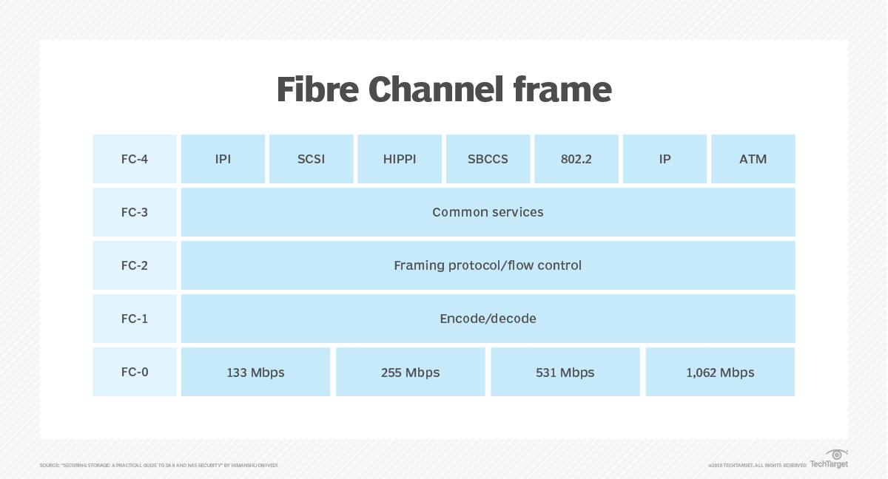

### Fibre Channel components

- Switches. A Fibre Channel switch enables a high-availability, low-latency, high-performance and lossless data transfer in a Fibre Channel fabric. It determines the origin and destination of data packets to send to their intended destination. As the main components used in a SAN, Fibre Channel switches can interconnect thousands of storage ports and servers. Features in Fibre Channel director-class switches include zoning to block unwanted traffic and encryption.
- Host bus adapters (HBAs). Fibre Channel HBAs are cards that connect servers to storage and network devices. An HBA is similar in principle to an Ethernet network adapter. It offloads server processing of data storage tasks and improves server performance. When Fibre Channel and Ethernet networks first converged, HBA vendors developed converged network adapters (CNAs) that combine the functionality of a Fibre Channel HBA with an Ethernet network interface card (NIC).
- Ports. Fibre Channel switches and HBAs connect to each other and to servers through physical or virtual ports. Data in a Fibre Channel fabric node is sent and received through ports that come in an assortment of logical configurations. Fibre Channel switches can have fewer than 10 ports to hundreds of ports in a chassis. The connections between ports and HBAs are established using physical copper or optical cables.
- Software. Fibre Channel installations depend on a software layer for device drivers, along with control and management between hosts, ports, and devices. Software offers a visualization of the Fibre Channel environment and enables oversight and control of Fibre Channel resources from a central console.

### Fibre Channel design and configuration

#### Topologies

- Point-to-point. The simplest and most limited Fibre Channel topology connects two devices or ports together, such as linking a host server to direct-attached storage.

- Arbitrated loop. Devices are linked in a circular, ringlike manner. Each node or device on the ring sends data to the next node. Bandwidth is shared among all devices. If one device or port fails, all of them could be interrupted unless a Fibre Channel hub is used to connect multiple devices and bypass failed ports. The maximum number of devices that can be in an arbitrated loop is 127; for practical reasons, the number is limited to far fewer.

- Switched fabric. All devices in this topology connect and communicate via switches, which optimizes data paths using the Fabric Shortest Path First routing protocol and lets multiple pairs of ports interconnect concurrently. Ports do not connect directly but, instead, flow through switches. When one port fails, the operation of other ports should not be affected. All nodes in the fabric work simultaneously, increasing efficiency, while redundancy of paths between devices increases availability. Switches can be added to the fabric without taking the network down.

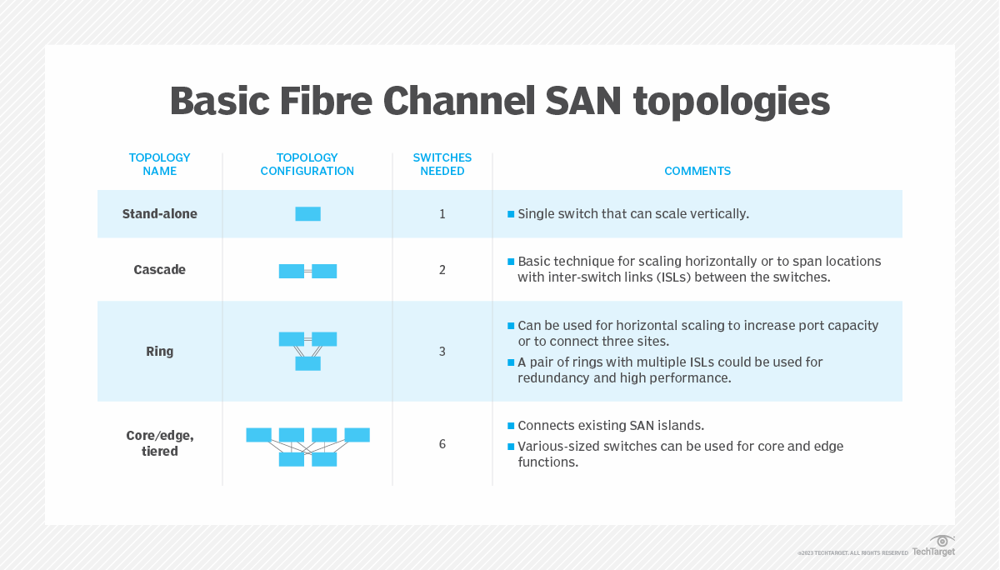

#### Fibre Channel vs. iSCSi SANs

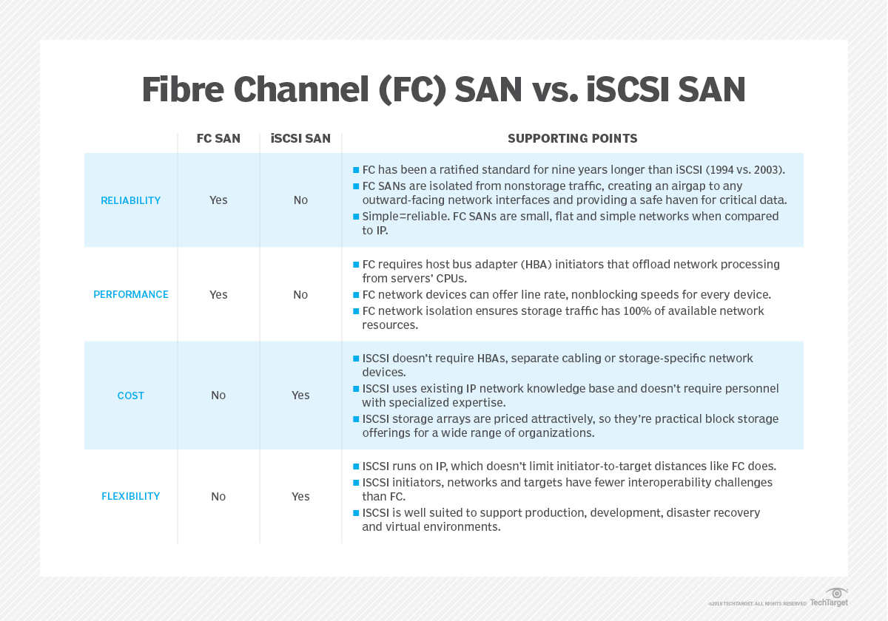

#### Fibre Channel vs. Ethernet

Fibre Channel and Ethernet are two different types of network technologies that traditionally serve different purposes across the enterprise.
##### Fibre Channel

In general terms, Fibre Channel supports the in-order and lossless transmission of raw block data. These capabilities have made it indispensable for high-performance data handling between servers and storage subsystems.

Fibre Channel networks operate at powers-of-two-based speeds, ranging from 1 Gbps to 128 Gbps, with 256 Gbps and 512 Gbps versions coming in the future.

Fibre Channel is light on security features, but most deployments are isolated within the enterprise and are not connected to other networks or the internet. This provides natural security from intrusion and hacking.
##### Ethernet

By comparison, Ethernet provides general purpose, out-of-order, loss-tolerant packet networking technology used in local area networks (LANs) and wide area networks. Ethernet is broadly available and highly standardized. The standards it's based on include IEEE 802.3 and the conventional OSI layer model. Ethernet also supports long cable distances and handles speeds ranging from 1 Gbps to 400 Gbps.

Its wide adoption and vulnerable TCP/IP protocol make Ethernet networks and connected systems more vulnerable to attack, requiring additional security measures. Still, Ethernet is often the network of choice for basic storage connectivity, such as network-attached storage systems.

#### Fibre Channel over Ethernet (FCoE)

Given the tradeoffs between Fibre Channel and Ethernet, designers have sought ways to connect the two different technologies. Fibre Channel over Ethernet is a network approach that encapsulates Fibre Channel data and data formats over common 10 Gbps and faster Ethernet networks. This essentially replaces Layer 0 and Layer 1 of the Fibre Channel stack with corresponding Ethernet layers and allows Fibre Channel commands and data to travel over Ethernet LANs.

However, FCoE is not a routable protocol and will not work over routed IP networks. FCoE is an international standard covered in the T11 FC-BB-5 standard published in 2009. When implemented properly, FCoE integrates Fibre Channel with Ethernet-based applications and management software.

FCoE adds three major capabilities to allow Fibre Channel operation over Ethernet:

    Fibre Channel frames must be encapsulated into Ethernet frames.
    FCoE must facilitate a lossless environment where frames are not lost and retransmitted in response to network congestion.
    FCoE must map Fibre Channel N_port IDs to conventional Ethernet MAC addresses. Computers can access FCoE using CNAs, which provide both Fibre Channel HBA and Ethernet NIC functions on the same device.

## iSCSI (Internet Small Computer System Interface)

ISCSI (Internet Small Computer System Interface) is a transport layer protocol that describes how Small Computer System Interface (SCSI) packets should be transported over a TCP/IP network.

ISCSI works on top of TCP and allows the SCSI command to be sent end-to-end over local area networks (LANs), wide area networks (WANs) or the internet.

### How iSCSI works

ISCSI transports block-level data between an iSCSI initiator on a server and an iSCSI target on a storage device. The iSCSI protocol encapsulates SCSI commands and assembles the data in packets for the TCP/IP layer. Packets are sent over the network using a point-to-point connection. Upon arrival, the iSCSI protocol disassembles the packets, separating the SCSI commands so the operating system will see the storage as if it was a locally connected SCSI device that can be formatted as usual.
Image of iSCSI SAN deployment

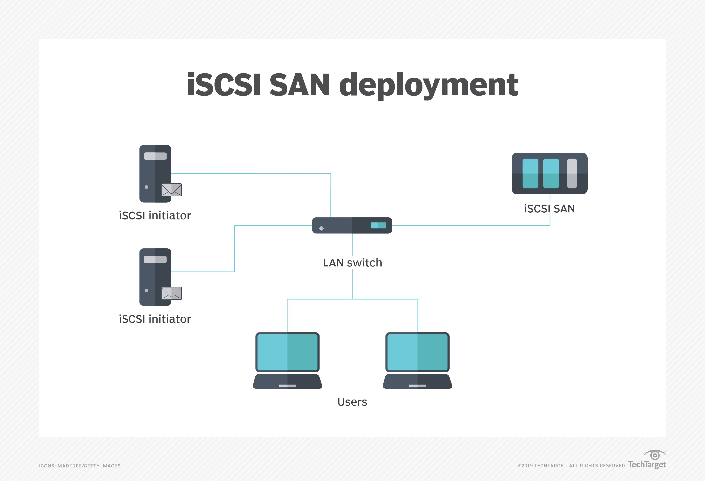
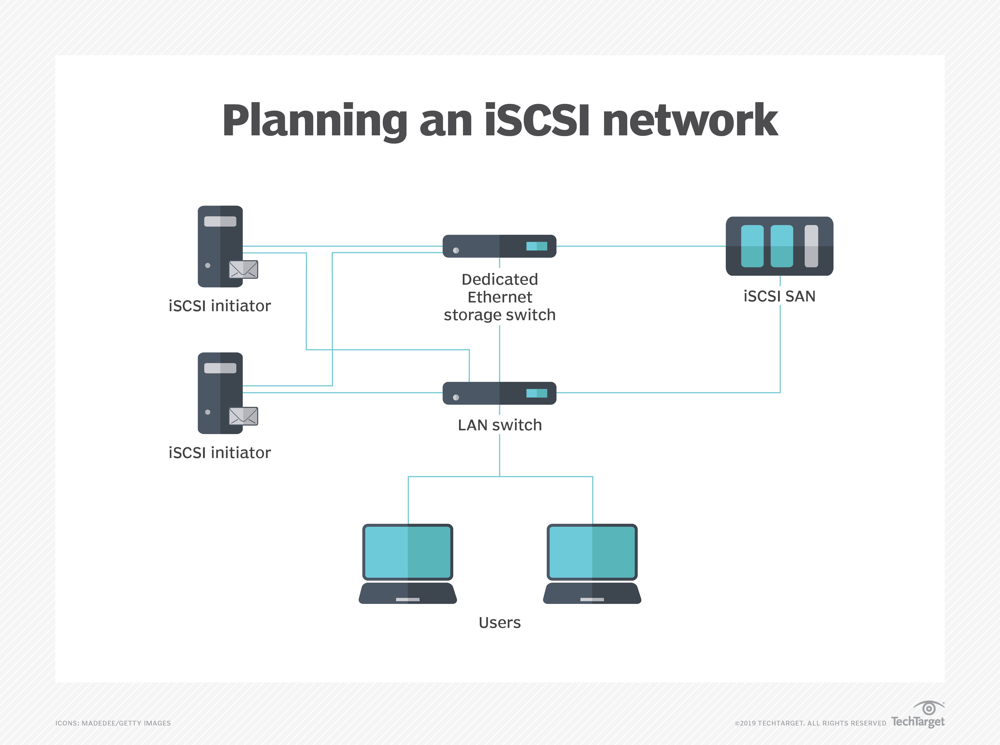

### Components of iSCSI

#### ISCSI initiator

An iSCSI initiator is a piece of software or hardware that is installed in a server to send data to and from an iSCSI-based storage array or iSCSI target.

#### ISCSI target

In the iSCSI configuration, the storage system is the "target." The target is essentially a server that hosts the storage resources and allows access to the storage through one or more NICs, HBAs or iSOEs.

### ISCSI performance

Many iSCSI implementations are based on a 1 gigabit per second Ethernet (GbE) infrastructure. For all but the smallest environments, though, 10 GbE should be considered the base configuration for performance that rivals that of a Fibre Channel storage network.

Jumbo frames -- another Ethernet protocol enhancement -- enable iSCSI storage systems to ship larger amounts of data than allowable with standard Ethernet frame sizes. Moving bigger chunks of data at a time also yields performance improvements.

Data center bridging (DCB) is another technical development that makes Ethernet-based storage more reliable while enhancing performance. DCB is a set of standards sanctioned by IEEE that help mitigate dropped frames. They make it possible to allocate bandwidth so that performance-hungry applications don't have to contend with less voracious apps.

### Ethernet alternatives to iSCSI

ISCSI is the most popular approach to storage data transmission over IP networks, but there are alternatives, such as the following:

    Fibre Channel over IP (FCIP), also known as Fibre Channel tunneling, moves data between SANs over IP networks to facilitate data sharing over a geographically distributed enterprise.

    Internet Fibre Channel Protocol (iFCP) is an alternative to FCIP that merges SCSI and FC networks into the internet.

    Fibre Channel over Ethernet (FCoE) became an official standard in 2009. Pushed by Cisco Systems and other networking vendors, it was developed to make 

    Ethernet more suitable for transporting data packets to reduce the need for Fibre Channel. But while it is used in top-of-rack switches with Cisco servers, FCoE is rarely used in SAN switching.

    ATA over Ethernet (AoE) is another Ethernet SAN protocol that has been sold commercially, mainly by Coraid Inc. AoE translates the Advanced Technology Attachment (ATA) storage protocol directly to Ethernet networking rather than building on a high-level protocol, as iSCSI does with TCP/IP.

### ISCSI security

The primary security risk to iSCSI SANs is that an attacker can sniff transmitted storage data. Storage administrators can take steps to lock down their iSCSI SAN, such as using access control lists to limit user privileges to particular information in the SAN. Challenge-Handshake Authentication Protocol and other authentication protocols secure management interfaces and encryption for data in motion and data at rest.

Also, because of its Ethernet pedigree, some companies will use their outward facing Ethernet data networks for iSCSI storage as well. This is not a recommended practice, however, as it may expose the storage infrastructure to internet-borne viruses, malware and ransomware. The iSCSI supporting network should be isolated from external access if possible.

## RAID

RAID (redundant array of independent disks) is a way of storing the same data in different places on multiple hard disks or solid-state drives (SSDs) to protect data in the case of a drive failure. There are different RAID levels, however, and not all have the goal of providing redundancy.

RAID works by placing data on multiple disks and allowing input/output (I/O) operations to overlap in a balanced way, improving performance. Because using multiple disks increases the mean time between failures, storing data redundantly also increases fault tolerance.

RAID employs the techniques of disk mirroring or disk striping. Mirroring will copy identical data onto more than one drive. Striping partitions help spread data over multiple disk drives. Each drive's storage space is divided into units ranging from a sector of 512 bytes up to several megabytes. The stripes of all the disks are interleaved and addressed in order. Disk mirroring and disk striping can also be combined in a RAID array.

### RAID controller

A RAID controller is a device used to manage hard disk drives in a storage array. It can be used as a level of abstraction between the OS and the physical disks, presenting groups of disks as logical units. Using a RAID controller can improve performance and help protect data in case of a crash.

A RAID controller may be hardware- or software-based. In a hardware-based RAID product, a physical controller manages the entire array. The controller can also be designed to support drive formats such as Serial Advanced Technology Attachment and Small Computer System Interface. A physical RAID controller can also be built into a server's motherboard.

With software-based RAID, the controller uses the resources of the hardware system, such as the central processor and memory. While it performs the same functions as a hardware-based RAID controller, software-based RAID controllers may not enable as much of a performance boost and can affect the performance of other applications on the server.

If a software-based RAID implementation is not compatible with a system's boot-up process and hardware-based RAID controllers are too costly, firmware, or driver-based RAID, is a potential option.

### Benefits of RAID

Advantages of RAID include the following:

- Improved cost-effectiveness because lower-priced disks are used in large numbers.
- Using multiple hard drives enables RAID to improve the performance of a single hard drive.
- Increased computer speed and reliability after a crash, depending on the configuration.
- Reads and writes can be performed faster than with a single drive with RAID 0. This is because a file system is split up and distributed across - drives that work together on the same file.
- There is increased availability and resiliency with RAID 5. With mirroring, two drives can contain the same data, ensuring one will continue to work if the other fails.

### Downsides of using RAID

RAID does have its limitations, however. Some of these include:

- Nested RAID levels are more expensive to implement than traditional RAID levels, because they require more disks.
- The cost per gigabyte for storage devices is higher for nested RAID because many of the drives are used for redundancy.
- When a drive fails, the probability that another drive in the array will also soon fail rises, which would likely result in data loss. This is because all the drives in a RAID array are installed at the same time, so all the drives are subject to the same amount of wear.
- Some RAID levels -- such as RAID 1 and 5 -- can only sustain a single drive failure.
- RAID arrays, and the data in them, are vulnerable until a failed drive is replaced and the new disk is populated with data.
- Because drives have much greater capacity now than when RAID was first implemented, it takes a lot longer to rebuild failed drives.
- If a disk failure occurs, there is a chance the remaining disks may contain bad sectors or unreadable data, which may make it impossible to fully rebuild the array.
### When should you use RAID?

Instances where it is useful to have a RAID setup include:

- When a large amount of data needs to be restored. If a drive fails and data is lost, that data can be restored quickly, because this data is also stored in other drives.
- When uptime and availability are important business factors. If data needs to be restored, it can be done quickly without downtime.
- When working with large files. RAID provides speed and reliability when working with large files.
- When an organization needs to reduce strain on physical hardware and increase overall performance. As an example, a hardware RAID card can include additional memory to be used as a cache.
- When having I/O disk issues. RAID will provide additional throughput by reading and writing data from multiple drives, instead of needing to wait for one drive to perform tasks.
- When cost is a factor. The cost of a RAID array is lower than it was in the past, and lower-priced disks are used in large numbers, making it cheaper.

## SAN

A storage area network (SAN) is a dedicated high-speed network or subnetwork that interconnects and presents shared pools of storage devices to multiple servers.

SAN technology addresses advanced enterprise storage demands by providing a separate, dedicated, highly scalable high-performance network designed to interconnect a multitude of servers to an array of storage devices. The storage can then be organized and managed as cohesive pools or tiers. A SAN enables an organization to treat storage as a single collective resource that can also be centrally replicated and protected, while additional technologies, such as data deduplication and RAID, can optimize storage capacity and vastly improve storage resilience -- compared to traditional direct-attached storage (DAS).

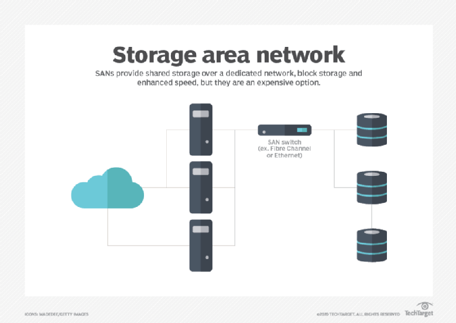

### What storage area networks are used for

Simply stated, a SAN is a network of disks that is accessed by a network of servers. There are several popular uses for SANs in enterprise computing.

-  A SAN is typically employed to consolidate storage. For example, it's common for a computer system, such as a server, to include one or more local storage devices. But consider a data center with hundreds of servers, each running virtual machines that can be deployed and migrated between servers as desired. If the data for one workload is stored on that local storage, the data might also need to be moved if the workload is migrated to another server or restored if the server fails. Rather than attempt to organize, track and use the physical disks located in individual servers throughout the data center, a business might choose to move storage to a dedicated storage subsystem, such as a storage array, where the storage can be collectively provisioned, managed and protected.
- A SAN can also improve storage availability. Because a SAN is essentially a network fabric of interconnected computers and storage devices, a disruption in one network path can usually be overcome by enabling an alternative path through the SAN fabric. Thus, a single cable or device failure doesn't leave storage inaccessible to enterprise workloads.

### DAS vs SAN

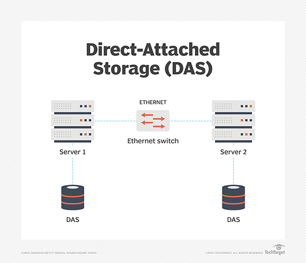

#### DAS 
With DAS, one or more disks are directly connected to a specific computer through a dedicated storage interface, such as SATA or SAS. The disks are often used to hold applications and data intended to run on that specific server. Although the DAS devices on one server can be accessed from other servers, the communication takes place over the common IP network -- the LAN -- alongside other application traffic. Accessing and moving large quantities of data through the everyday IP network can be time-consuming, and the bandwidth demands of large data movements can affect the performance of applications on the server.

#### SAN

A SAN operates in a profoundly different manner. The SAN interconnects all the disks into a dedicated storage area network. That dedicated network exists separate and apart from the common LAN. This approach enables any of the servers connected to the SAN to access any of the disks attached to the SAN, effectively treating storage as a single collective resource. None of the SAN storage data needs to pass across the LAN -- mitigating LAN bandwidth needs and preserving LAN performance. Because the SAN is a separate dedicated network, the network can be designed to emphasize performance and resilience, which are beneficial to enterprise applications.

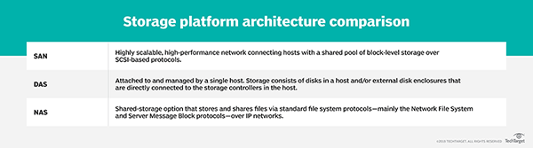

There are two principal types of networking technologies and interfaces employed for SANs: Fibre Channel and iSCSI.

### How SAN works

A SAN is essentially a network that is intended to connect servers with storage. The goal of any SAN is to take storage out of individual servers and locate the storage collectively where storage resources can be centrally managed and protected. Such centralization can be performed physically, such as by placing disks into a dedicated storage subsystem like a storage array. But centralization can also be increasingly handled logically through software -- such as VMware vSAN -- which relies on virtualization to find and pool available storage.

A SAN is generally perceived as a series of three distinct layers: a host layer, a fabric layer and a storage layer. Each layer has its own components and characteristics.

1. Host layer. The host layer represents the servers that are attached to the SAN. In most cases, the hosts -- servers -- are running enterprise workloads, such as databases, that require access to storage. SAN hosts also incorporate a separate network adapter that is dedicated to SAN access. The network adapter used for most FC SANs is called a host bus adapter (HBA).

2. Fabric layer. The fabric layer represents the cabling and network devices that comprise the network fabric that interconnects the SAN hosts and SAN storage. SAN networking devices within the fabric layer can include SAN switches, gateways, routers and protocol bridges. Cabling and the corresponding ports of SAN fabric devices can employ optical fiber connections -- for long range network communication -- or traditional copper-based cables for shore-range local network communication. The difference between a network and a fabric is redundancy: the availability of multiple alternate pathways from hosts to storage across the fabric. When a SAN fabric is constructed, multiple connections are generally implemented to provide multiple paths. If one path is damaged or disrupted, SAN communication will use an alternative path.

3. Storage layer. The storage layer is comprised of the various storage devices collected into various storage pools, tiers or types. Storage typically involves traditional magnetic HDDs but can also include SSDs along with optical media devices, such as CD and DVD drives, and tape drives. Most storage devices within a SAN are organized into physical RAID groups that can be employed to increase storage capacity, improve storage device reliability or both. Logical storage entities, such as RAID groups or even disk partitions, are each assigned a unique LUN that serves the same basic purpose as a disk drive letter, such as C or D. Thus, any SAN host can potentially access any SAN LUN across the SAN fabric. By organizing storage resources and designating storage entities in such a manner, an organization can permit which host can access specific LUNs, enabling the business to exert granular control over the organization's storage assets. There are two basic methods for controlling SAN permissions: LUN masking and zoning. Masking is essentially a list of the LUNs that are unavailable to or shouldn't be accessed by a SAN host. By comparison, zoning controls host access to LUNs by configuring the fabric itself, limiting host access to storage LUNs that are in an approved -- allowed -- SAN zone.

### SAN fabric architecture and operation

The core of a SAN is its fabric: the scalable, high-performance network that interconnects hosts -- servers -- and storage devices or subsystems. The design of the fabric is directly responsible for the SAN's reliability and complexity. At its simplest, an FC SAN can simply attach HBA ports on servers directly to corresponding ports on SAN storage arrays, often using optical cables for top speed and support for networking over greater physical distances.

But such simple connectivity schemes belay the true power of a SAN. In actual practice, the SAN fabric is designed to enhance storage reliability and availability by eliminating single points of failure. A central strategy in creating a SAN is to employ a minimum of two connections between any SAN elements. The goal is to ensure that at least one working network path is always available between SAN hosts and SAN storage.

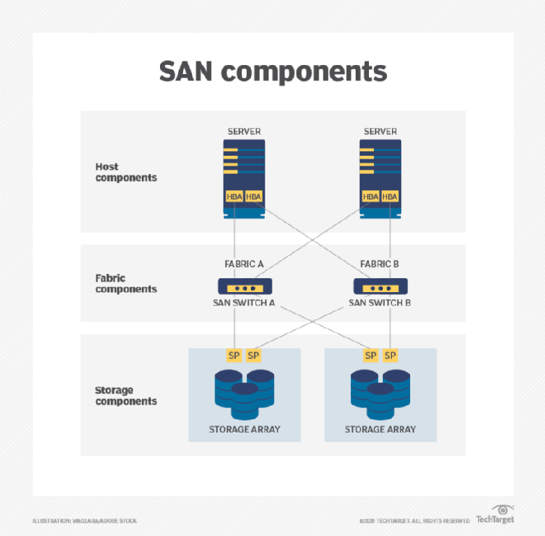

### Alternative SAN approaches

1. Virtual SAN. A virtual SAN -- denoted with a capital V in VSAN -- is a form of isolation, reminiscent of traditional SAN zoning, which essentially uses virtualization to create one or more logical partitions or segments within the physical SAN. Traditional VSANs can employ such isolation to manage SAN network traffic, enhance performance and improve security.
2. Unified SAN. A SAN is noted for its support of block storage, which is typical for enterprise applications. But file, object and other types of storage would traditionally demand a separate storage system, such as network-attached storage (NAS). A SAN that supports unified storage is capable of supporting multiple approaches -- such as file, block and object-based storage -- within the same storage subsystem. Unified storage provides such capabilities by handling multiple protocols, including file-based SMB and NFS, as well as block-based, such as FC and iSCSI.
3. Converged SAN. One common disadvantage to a traditional FC SAN is the cost and complexity of a separate network dedicated to storage. ISCSI is one means of overcoming the cost of a SAN by using common Ethernet networking components rather than FC components. FCoE supports a converged SAN that can run FC communication directly over Ethernet network components -- converging both common IP and FC storage protocols onto a single low-cost network. 
4. Hyper-converged infrastructure. The data center use of HCI has grown dramatically in recent years. HCI combines compute and storage resources into pre-packaged modules, allowing modules -- also called nodes -- to be added as needed and managed through a single common utility. HCI employs virtualization, which abstracts and pools all the compute and storage resources. IT administrators then provision virtual machines and storage from the available resource pools. The fundamental goal of HCI is to simplify hardware deployment and management while allowing fast scalability.

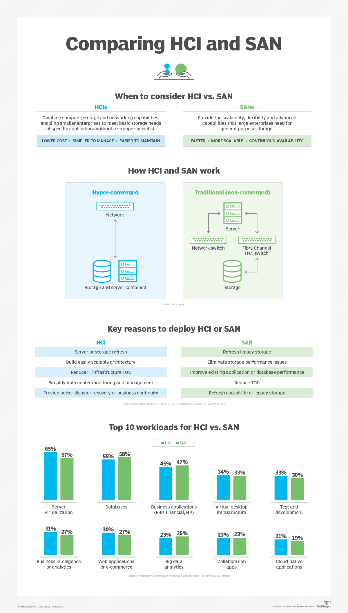

### SAN +

- High performance. The typical SAN uses a separate network fabric that is dedicated to storage tasks. The fabric is traditionally FC for top performance, though iSCSI and converged networks are also available.
- High scalability. The SAN can support extremely large deployments encompassing thousands of SAN host servers and storage devices or even storage systems. New hosts and storage can be added as required to build out the SAN to meet the organization's specific requirements.
- High availability. A traditional SAN is based on the idea of a network fabric, which -- ideally -- interconnects everything to everything else. This means a full-featured SAN deployment has no single point of failure between a host and a storage device, and communication across the fabric can always find an alternative path to maintain storage availability to the workload.
- Advanced management features. A SAN will support an array of useful enterprise-class storage features, including data encryption, data deduplication, storage replication and self-healing technologies intended to maximize storage capacity, security and data resilience. Features are almost universally centralized and can easily be applied to all the storage resources on the SAN.

### SAN -

- Complexity. Although more convergence options, such as FCoE and unified options, exist for SANs today, traditional SANs present the added complexity of a second network -- complete with costly, dedicated HBAs on the host servers, switches and cabling within a complex and redundant fabric and storage processor ports at the storage arrays. Such networks must be designed and monitored with care, but the complexity is increasingly troublesome for IT organizations with fewer staff and smaller budgets.
- Scale. Considering the cost, a SAN is generally effective only in larger and more complex environments where there are many servers and significant storage. It's certainly possible to implement a SAN on a small scale, but the cost and complexity are difficult to justify. Smaller deployments can often achieve satisfactory results using an iSCSI SAN, a converged SAN over a single common network -- such as FCoE -- or an HCI deployment, which is adept at pooling and provisioning resources.
- Management. With the idea of complexity focused on hardware, there is also significant challenge in SAN management. Configuring features, such as LUN mapping or zoning, can be problematic for busy organizations. Setting up RAID and other self-healing technologies as well as corresponding logging and reporting -- not to mention security -- can be time-consuming but unavoidable to maintain the organization's compliance, DR and BC postures.

### SAN vs. NAS

Network-attached storage (NAS) is an alternative means of storing and accessing data that relies on file-based protocol, such as SMB and NFS -- as opposed to the block-based protocols such as FC and iSCSI used in SANs. There are other differences between a SAN and NAS. Where SAN uses a network to connect servers and storage, a NAS relies on a dedicated file server located between servers and storage.

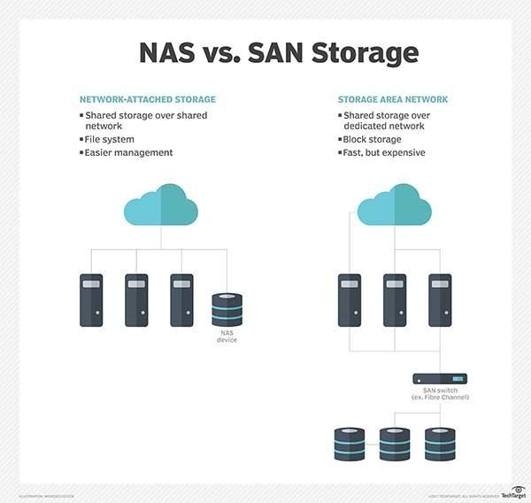

SAN is the preferred choice for block-based data storage, which usually applies well to structured data -- such as storage for enterprise-class relational database applications. By comparison, a NAS -- with its file-based approach -- is better suited to unstructured data -- such as document files, emails, images, videos and other common types of files. 

## Disk arrays

A disk array, also called a storage array, is a data storage system used for block-based storage, file-based storage or object storage. The term is used to describe dedicated storage hardware that contains spinning hard disk drives (HDDs) or solid-state drives (SSDs).

Arrays combine a series of drives into one system that can store up to petabytes of data under a central management system. Disk arrays were designed to separate storage from servers so systems could be built into large, monolithic configurations for block- or file-based storage.

### How they work?

They also contain controllers -- the brains of the system -- that provide a level of abstraction between the operating system (OS) and physical drives. A controller has the ability to access copies of data across physical devices and can take the form of a Peripheral Component Interconnect or PCI Express card designed to support a specific drive format, such as Serial Advanced Technology Attachment or Serial-Attached Small Computer System Interface (SCSI). Newer flash systems also support non-volatile memory express drives.

A disk array usually includes a shelf enclosure in a cabinet that holds the drives and controllers. Drives are grouped into pools, which are divided into volumes with a defined RAID level and amount of storage capacity. Applications and file systems store data in volumes. Each volume is connected to a server.

### SAN vs. NAS

SAN and NAS are the main types of disk arrays. SANs are designed mostly for block storage, also known as structured data inside databases. NAS systems are mainly used for file storage or unstructured data.

Networked storage -- SANs and NAS -- consist of storage arrays connected to application servers through fabric such as Fibre Channel (FC) or Ethernet. FC was developed specifically for SANs. Ethernet is the most common type of network connectivity and is used for NAS. SANs that don't require the performance and reliability of FC can use Ethernet through the Internet SCSI protocol.

## Virtualization

### VM Isolation
Each virtual machine is isolated from other virtual machines running on the same hardware. Although virtual machines share physical resources such as CPU, memory, and I/O devices, a guest operating system on an individual virtual machine can only detect the virtual devices that you make available to it. 

The VMkernel mediates all physical resources. All physical hardware access takes place through the VMkernel and virtual machines cannot circumvent this level of isolation. 

Virtual networking is also affected by virtual machine isolation.

    If a virtual machine does not share a virtual switch with any other virtual machine, it is completely isolated from virtual machines within the host.
    If no physical network adapter is configured for a virtual machine, the virtual machine is completely isolated. This includes isolation from any physical or virtual networks.
    Virtual machines are as secure as physical machines if you protect them from the network with firewalls, antivirus software, and so on.

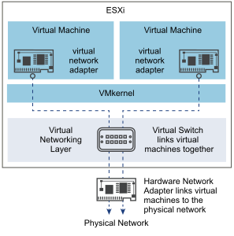

Resource reservations and limits protect virtual machines from performance degradation that might result if another virtual machine consumed excessive shared hardware resources. For example, if one of the virtual machines on a host is incapacitated by a denial-of-service (DoS) attack, a resource limit on that machine prevents the attack from taking up so much of the hardware resources that the other virtual machines are also affected. Similarly, a resource reservation on each of the virtual machines ensures that in the event of high resource demands by the virtual machine targeted by the DoS attack, all the other virtual machines have enough resources to operate. 

### VM Encapsulation
Encapsulation is one of the four key benefits of VMware virtual machines.

If you are a VMware ESX administrator, you know that a VMware virtual machine consists of several files,  normally contained in a single directory.  There is a configuration file, virtual disk files, and a few other supporting files.  Having all necessary VM files in one directory is the essence of encapsulation.

Let’s say that you have a development environment — not protected by VMware HA — that experiences a host failure.  You repair the host, reinstall ESX, and reattach the disk that contains your virtual machines.  In order to have ESX recognize a VM, it must be registered.  This is easily done with the Datastore Browser, just right-click on the .vmx file and select “Add to Inventory.”

This task can also be performed on the ESX service console (i.e., not ESXi) by using the vmware-cmd utility.

### VM compatibility

When virtual machines are created in a particular hypervisor platform, it will be difficult to use in a different hypervisor environment. Most often, virtualization file formats are highly incompatible and to achieve compatibility across multiple hypervisors there are certain criteria to be considered.

Having a working knowledge of virtualization file and disk format is essential when it comes to virtual machine compatibility across multiple hypervisor environments. Two different files to the least, are required to store a virtual machine, which is a hard disk file that is implemented to store all the files that are used within the virtual machine and a second file that describes the virtual machine itself. While transforming a virtual machine from a particular hypervisor to a different hypervisor, it should be made sure that both the files are adaptable to the target hypervisor. It is also important to make sure that the source disk formats are usable on the target hypervisor platform. There are a numerous number of disk format types with multiple features that enhance the hypervisor program. This might lead to the difficult compatibility with the hypervisor. The common disk format includes virtual machine disk (VMDK), RAW, virtual hard disk (VHD) and Qcow2.

### Live migration

Live migration refers to the process of moving a virtual machine (VM) running on one physical host to another host without disrupting normal operations or causing any downtime or other adverse effects for the end user.

Live migration is usually performed when a physical host machine (computer or server) needs maintenance or an update, or when a VM must be switched to a different host. The process transfers the VM memory, network connectivity and storage. Most of the migration occurs while the OS continues to run.

The live migration process starts by transferring the data in the VM's memory to the target physical machine. Once all the data is transferred, an "operational resource state" consisting of CPU, memory and storage is created on the target machine.

After this, the original VM -- along with its installed applications -- is suspended, copied and initiated on the destination. This entire process causes minimal downtime. Although it's not possible to completely avoid downtime, it can be further reduced with pre-paging and by using the memory's probability density function.

#### Live migration +

- Migrating an entire OS and all its applications as one unit can eliminate many of the difficulties involved in process-level migration approaches. This method eliminates the issue of residual dependencies that require the original host machine to remain available and network-accessible to service memory accesses or system calls on behalf of migrated processes.

- Migrating at the entire VM level also means that its in-memory state can be transferred consistently and efficiently. This applies to both the kernel internal state and application level state.

- Live migration supports more efficient load balancing, so systems and CPU resources can be shared for optimum use.

- It also allows applications to continue running while the administrator manages maintenance activities, such as security updates, in the background.

- live migration minimizes system downtime by using the pre-paging approach in which the OS guesses in advance which pages of memory will be required, and proactively pre-loads them into the main memory without halting the VM being migrated.
#### Live migration requirements

Live migration ensures that the consistent VM image remains in at least one host. However, process success hinges on two key requirements:

- Original host remains stable: Throughout the migration process, the original host must be stable without any interruption until the commitment stage.
- Suspending and resuming VM: The VM can be suspended and resumed in the physical host without a risk of failure.

